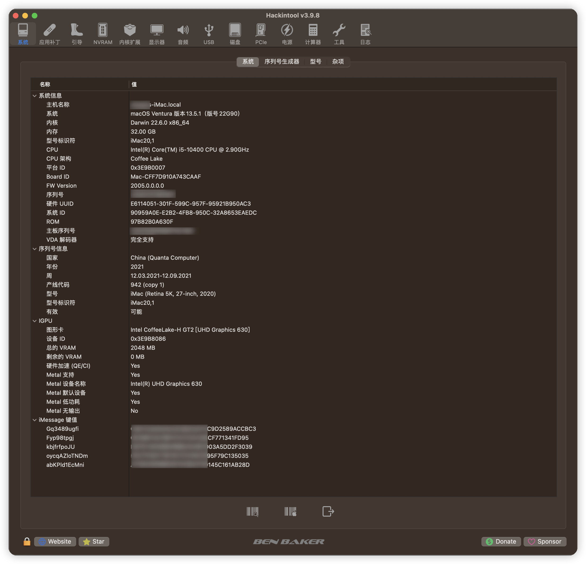
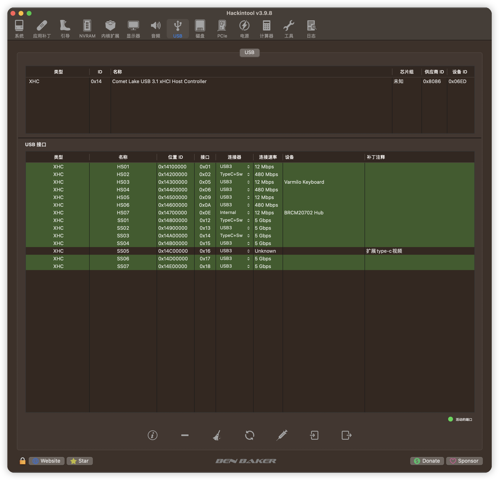

# OpenCore on Dell OptiPlex 7080 MFF

> 1、OpenCore 0.94 for macOS Ventura (13.5.1) on Dell OptiPlex 7080 MFF
>
> 2、使用本分支里的EFI首先 要生成自己的五码，我已经EFI里的改了，为了不和我现在使用的序列号冲突
>
> 3、目前仿冒的mac机型我选择是: iMac20,1

## 配置详情

> 目前当成主机里使用，只安装了单系统MacOS 13 Ventura，系统使用Monterey升级过来,OpenCore 使用的是0.9.4最近的引导。

-   Dell OptiPlex 7080 MFF 【标压版本，180W电源】
-   CPU: Intel Comet Lake i5-10400
-   主板型号t: Intel Q470
-   内存条: 16G DDR4 3200 \* 2
-   iGPU: UHD 630
-   硬盘: 致钛Tiplus5000 512GB
-   声卡: ALC256
-   千兆有线网卡: Intel I219-LM7
-   无线网卡  BCM94360CS2 M.2

## 黑苹果的效果

### @界面效果

1、关于本机

2、娱乐跑分

​	

3、军刀上的信息展示

3.1电脑信息

3.2 定制的usb【ss05应该是扩展的typc的兼视频的接口，我归还朋友的type-c视频扩展坞，淘宝闲鱼有卖挺贵的】

3.3 声卡的驱动

.png)

### @ 常工作的硬件功能 (使用 BCM94360CS2白果卡)

-   HWP
-   睡眠、隔空、随行等正常使用
-   iGPU with HiDPI
-   千兆有线网卡
-   wifi无线网正常使用
-   蓝牙
-   喇叭声音正常
-   DP/HDMI 声音正常使用

### @ 不常工作

1、2023-8-29 上传的EFI 已经解决了无辜重启的原因，使用了一周没有发生重启。

### @ 注意事项

1、使用了BCM94360cs2 免驱网卡， dell 外置天线连接网卡的触点槽不要安装反了（暂时无图，以后会补），安装反了，导致 连接wifi2.4G情况下，使用苹果的触控板，触控板的光标会发虚，光标在屏幕内发飘，或者光标卡顿，看了网上说的是蓝牙和2.4G冲突了，连接wifi选5G 就没事，暂时手头无线网不支持5G的频段，没测试；**我更换了网卡上的连接天线的触点位置，wifi正常、妙控板正常**。

2、!!! 请注意，目前存在我本机，测试发现  ，电脑间歇性的重启（结果排查原因  Intel Power Gadget软件）。

这个软件会在 电脑位置  /Library/Extensions/ EnergyDriver.kext 安装这个kext.这个文件

会导致 电脑崩溃，电脑间歇性的重启，毫无征兆的情况，后期在远景论坛看到一个大佬一个留言，删除了这个软件以及 EnergyDriver.kext 文件，找了清理软件，删的删除   Intel Power Gadget，后电脑长期不关机 也没出现重启；

本EFI的配置已经睿频了，可不用在意这个指标属性。

## BIOS主板设置【dell主机必须进行cfg-lock和DVMT的解锁，我手里的这台标压版本的bios版本不解锁 无法进入引导，！！！工具已经提供，使用前必须解锁】

| Settings                                        |Value|
|-------------------------------------------------|---|
| System Configuration → Integrated NIC           | Enabled |
| System Configuration → SATA Operation           | AHCI |
| Security → TPM 2.0  （必须关掉，不然影响睡眠）               | Disabled |
| Secure Boot → Secure Boot Enable                | Disabled |
| Secure Boot → Secure Boot Mode                  | Audit Mode |
| Intel SGE → SGX                                 | Disabled |
| Performance → Intel SpeedStep                   | Enabled |
| Performance → C-States Control                  | Enabled |
| Performance → Turboost                          | Enabled |
| Performance → HyperThread Control               | Enabled |
| Power Management → Intel Speed Shift Technology | Enabled |
| Power Management → Deep Sleep Control           | Disabled |
| Power Management → USB Wake Support             | Disabled |
| Power Management → Wake on LAN/WLAN             | Lan only |
| Power Management → Block Sleep                  | Disabled |
| POST Behavior → Fastboot                        | Minimal |
| Virtualization Support → Virtualization         | Enabled |
| Virtualization Support → VT For Direct I/O      | Disabled |
| Advanced configurations → ASPM                  | Auto |

## 修改DVMT和CFG LOCK的值 提供参考，
* 无法使用Grub Setup_var 需要用到Ru.efi 将Ru.efi在BIOS中添加进Boot Menus 后启动 进入Ru后按 "Alt" + "=" 并
查找 **CPUSetup** 和 **SaSetup**
* 解锁"CFG-LOCK" 找到CPUSetup 将横排 "0030" "0E" 位改为 00 按 Ctrl + W 保存
* 修改DVMT 搜索 SaSetup 将横排 "00F0" "05" 位改为 "02" 按 Ctrl + W 保存
